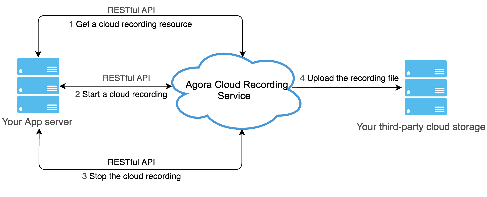
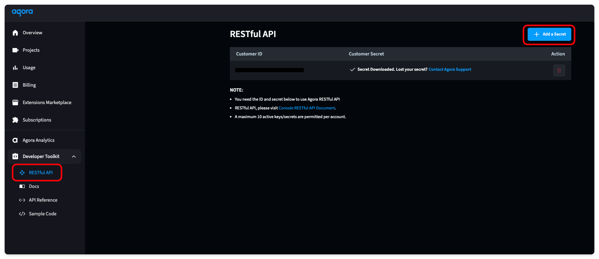
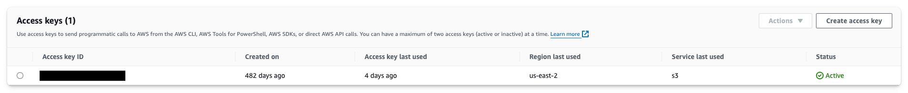
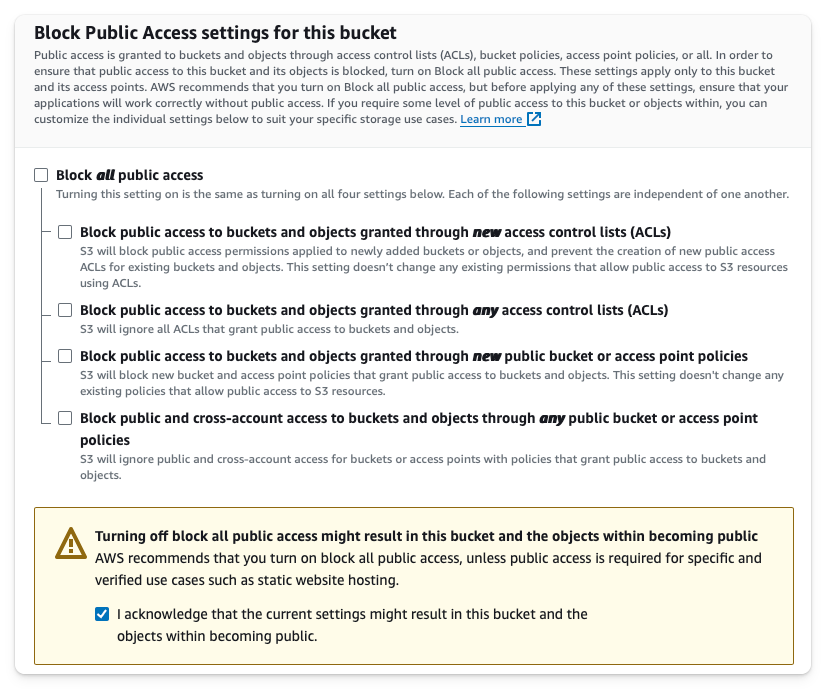

Not everyone can join every meeting. For example, I struggle to join the boring ones. For people like me, having a recording of the meeting is a game changer.

This guide is part two of a series about building a backend for your Agora video calls. The first guide was building a [token generator](https://github.com/AgoraIO-Community/astro-backend/blob/main/docs/TOKENS.md). This guide will use that token generator and add cloud recording to our video call.


## Prerequisites
1. NodeJS and Astro installed.
2. A developer account with [Agora](https://console.agora.io/).
3. A token generator built with Astro. Find the [guide here](https://github.com/AgoraIO-Community/astro-backend/blob/main/docs/TOKENS.md).
4. AWS S3 Storage Bucket.

## Project Setup
This guide will build upon the [token generator guide](https://github.com/AgoraIO-Community/astro-backend/blob/main/docs/TOKENS.md). The token generator guide walks through the process of building the `api/tokens.json` endpoint, which returns a token used to secure your video calls. This endpoint uses a `handleGenerateToken` function that handles token generation logic. Since it is in the same backend server, we will use this function directly within the cloud recording endpoint.

From the previous guide, you should have `APP_ID` and the `APP_CERTIFICATE` in your environment variables. We will add more environment variables throughout this guide, but for now, we can get started.


## Cloud Recording Overview
Cloud Recording is a RESTful API provided by Agora that allows you to record your video calls into a storage provider of your choice. Your backend should trigger this recording so that sensitive data isn't being passed to and from the application directly. 

The flow for a successful Cloud Recording session is as follows:
1. Acquire the Agora cloud recording resource.
2. Start the cloud recording using a custom storage configuration. This includes the necessary keys to allow writing files to your storage provider.
3. Query the status of the cloud recording every 30 seconds to ensure it is running properly.
4. Stop the cloud recording. 



## Enable Agora RESTful API
This whole guide relies on a connection to the Agora RESTful API. To connect to it, you will need a Customer ID and Customer Secret. You can find these by going into the Agora Console, selecting the RESTful API tab under Developer Toolkit, and clicking the "Add a Secret" button. Then, copy these values and store them in a `CUSTOMER_ID` and a `CUSTOMER_SECRET` environment variable.



## Connect to AWS S3 Bucket
Agora supports recording into most popular storage solutions. For this guide, we will use AWS S3. Now, AWS is a behemoth of complicated backend configurations. For this guide, we are trying to focus on the Agora implementation, so instead of building out a resilient AWS infrastructure, we will use a root user access key and a public bucket. 

Create a new root user access key by going to IAM and "My security credentials" and clicking the "Create access key" button. Then, save this information into `ACCESS_KEY` and `SECRET_KEY` environment variables.



Then, go into S3 and create a new bucket. Since we are building this for testing purposes, uncheck the "Block all public access". Save the name of your bucket in a `BUCKET_NAME` environment variable.



## Define an Endpoint
We will have three endpoints: `api/recording/start.json`, `api/recording/query.json`, and `api/recording/stop.json`. Because our endpoints need input information, we will use a `POST` request to pass the input as the request body.

We will check that these inputs are not empty. If they are, we will return a Bad Request response using our helper function from `utils/sendResponse.ts`. 

Our endpoints will need the following information in the body:
- `api/recording/start.json` will need `channel`
- `api/recording/query.json` will need `sid` and `resourceId`
- `api/recording/stop.json` will need `channel`, `sid`, and `resourceId`

If everything is executed properly, we send a successful response using our helper function with data we will fill in later.

```ts
import type { APIContext } from "astro";

export async function POST({ request }: APIContext) {
    const { channel } = await request.json()

    if (!channel) {
        return sendBadRequest("channel is required")
    }

    return sendSuccessfulResponse("<return data>")
}
```

## Make Request Helper Functions
The rest of this guide will focus on the implementation of Cloud Recording, which includes calling the Agora API. To simplify the code and have a uniform request structure, we will set up a helper function in `utils/makeRequest.ts`. 

The `makeRequest` function defines all the headers, executes the request, and returns the response. 

The inputs will need the `method` (we will use GET and POST), `url`, `body`, and the `credential`. 

```ts
export const makeRequest = async (method: string, url: string, credential: string, body?: string) => {
    const headers = new Headers({
        "Authorization": "basic " + credential,
        "Content-Type": "application/json",
        "Access-Control-Allow-Origin": "*",
        "Access-Control-Allow-Methods": `${method}, OPTIONS`,
    });

    const res = await fetch(url, {
        method: method,
        headers: headers,
        body: body
    })
    if (!res.ok) {
        console.log(await res.text())
        throw new Error("Failed to make request")
    }
    return res
}
```

Another helper function in `utils/generateCredential.ts` will generate this credential. It is a base-64 encoded credential using the Customer ID and Customer Secret.

```ts
export const generateCredential = () => {
  const credential = import.meta.env.CUSTOMER_ID + ":" + import.meta.env.CUSTOMER_SECRET

  const base64_credential = btoa(credential)
  return base64_credential
}
```

## Generate Resource
The first step to recording your video calls is to generate a resource for recording. Behind the scenes, this spins up a backend Agora service that can record video calls. 

> Warning: Your cloud recording needs to be started within five minutes, or else the resource will shut down.

To generate this resource, we make our first request to the Agora service. This will use the `acquire` function. You must pass the channel name and the uid for the resource. 

We don't need to create an endpoint for this function, since it will only be used when starting a cloud recording session within this same backend server. Because of this we define this function in the `utils/generateResource.ts` file to keep the code organized. 

```ts
import { makeRequest } from "./makeRequest"

export const generateCloudRecordingResource = async (channel: string, credential: string, uid: string, appId: string) => {

    const body = {
        "cname": channel,
        "uid": uid,
        "clientRequest": {}
    }

    const url = `https://api.agora.io/v1/apps/${appId}/cloud_recording/acquire`

    const res = await makeRequest("POST", url, credential, JSON.stringify(body))
    const data = await res.json()
    const resourceId = data["resourceId"]

    return resourceId
}
```

## Start Cloud Recording
We can combine the previous sections and start the recording within the POST request in the `api/recording/start.json.ts` file. We generate the credential, then use that credential to generate a resource, and create a token.

Then, we make a request with the Agora `start` endpoint URL and pass in the request body. This body defines all the information that the Agora cloud recording service needs.

You can find a complete list of request body properties within the [Agora documentation](https://docs.agora.io/en/cloud-recording/reference/restful-api#start-request). For this demo, we will define AWS as our vendor and US_EAST_2 as our region. Then, we supply all the information needed to access that storage bucket, and lastly, we define the file path and the file output type.

```ts
const recordingUid = "1"
const credential = generateCredential()
const resourceId = await generateCloudRecordingResource(channel, credential, recordingUid, APP_ID)
const token = await handleGenerateToken({ channel: channel, role: 1, uid: recordingUid, expireTime: 3600 })


const url = `https://api.agora.io/v1/apps/${APP_ID}/cloud_recording/resourceid/${resourceId}/mode/mix/start`
const body = {
    "cname": channel,
    "uid": recordingUid,
    "clientRequest": {
        "token": token,
        "storageConfig": {
            "secretKey": SECRET_KEY,
            "vendor": 1,
            "region": 1,
            "bucket": BUCKET_NAME,
            "accessKey": ACCESS_KEY,
            "fileNamePrefix": [
                "recording",
                Date.now().toString()
            ]
        },
        "recordingFileConfig": {
            "avFileType": [
                "hls",
                "mp4"
            ]
        },
    },
}

const res = await makeRequest("POST", url, credential, JSON.stringify(body))
const data = await res.json()
const sid = data.sid


return sendSuccessfulResponse({
    resourceId: resourceId,
    sid: sid
})
```

Upon a successful response, you will receive a `sid`. Both the `sid` and the `resourceId` will need to be used to stop or query the recording, so they must be returned to the caller.

To test this, run your backend using `npm run dev`. You can use cURL to send a `POST` request in your terminal with a body containing `channel`.

```
curl -X POST http://localhost:4321/api/recording/start.json \
  -H "Content-Type: application/json" \
  -d '{
    "channel": "test"
  }'
```

If your `POST` request is missing information, you will receive a Bad Request response telling you what you missed. If you have a proper request, you will receive a successful response that looks like this:

```
{"resourceId":"<long string>","sid":"<another long string>"}
```

## Query Cloud Recording
While the cloud recording is running, we want to query it periodically to ensure everything is running properly. 

We will use the Agora `query` url and call it using a GET method. 

```ts
const credential = generateCredential()

const url = `https://api.agora.io/v1/apps/${APP_ID}/cloud_recording/resourceid/${resourceId}/sid/${sid}/mode/mix/query`

const res = await makeRequest("GET", url, credential)
const data = await res.json()

return sendSuccessfulResponse(data)
```

To test this, you can use cURL and pass the `sid` and `resourceId` from the return of the start endpoint. 

> Note: You must be in a video call associated with this App ID and channel. The Agora backend doesn't start recording if there is nothing to record. 

```
curl -X POST http://localhost:4321/api/recording/query.json \
  -H "Content-Type: application/json" \
  -d '{
    "sid": "<from start command return>",
    "resourceId": "<from start command return>"
  }'
```


## Stop Cloud Recording
Finally, we need to stop the cloud recording. This is very similar to the start or query command, except it uses the Agora `stop` URL. 

```ts
const recordingUid = "1"
const credential = generateCredential()

const url = `https://api.agora.io/v1/apps/${APP_ID}/cloud_recording/resourceid/${resourceId}/sid/${sid}/mode/mix/stop`
const body = {
    "cname": channel,
    "uid": recordingUid,
    "clientRequest": {
    }
}

const res = await makeRequest("POST", url, credential, JSON.stringify(body))
const data = await res.json()

return sendSuccessfulResponse(data)
```

Once again, you can test this using cURL.

```
curl -X POST http://localhost:4321/api/recording/stop.json \
  -H "Content-Type: application/json" \
  -d '{
    "channel": "test"
    "sid": "<from start command return>",
    "resourceId": "<from start command return>"
  }'
```

You now have a fully working cloud recording backend with Astro and no longer have to worry about joining every meeting. 

Now that you have a token generator and a cloud recording backend built in Astro, you can add a front end and have a secure video call that can be recorded all from one codebase. Here is a [guide on how to build a Video Call front end with Astro](https://www.agora.io/en/blog/build-a-video-call-app-with-astro-and-reactjs/).