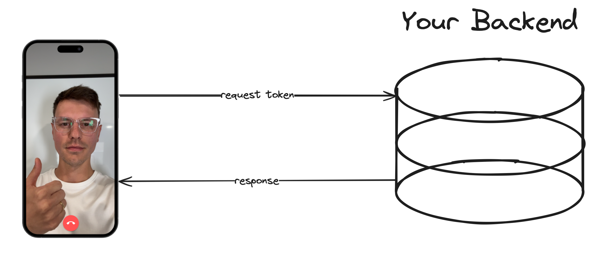

Astro is created to be the perfect use case for a content-heavy website. A content heavy site is mostly front end code. The opposite of that is a backend server, and in this guide, we will build a backend token generator for Agora video calls. 

I love building websites with Astro. It's my favorite web framework, and I don't want to use any other one. However, I must stress test it and ensure Astro is flexible enough to fully commit.

Spoilers. My love for Astro has grown deeper. 



## Prerequisites
1. NodeJS and Astro installed.
2. A developer account with [Agora](https://console.agora.io/).

## Project Setup
To create a new Astro project, run `npm create astro@latest`. Follow all the default options during the setup process, except use an empty template. This way, our project will be free of distractions. Then, we must install the Agora Token package to generate our tokens. You can do that using `npm i agora-token`.

To generate a token, we need to use our Agora App ID and App Certificate. The App Certificate is our "secret" key and should be hidden from public view. We will use a `.env` file to store our sensitive data. When we generated our Astro project, the `.env` was already listed in the `.gitignore`, which means it will not be pushed to GitHub. In the `.env`, add the project `APP_ID` and `APP_CERTIFICATE`, which you can find in your Agora Console.

## What is a Token?
Tokens are a form of authentication that verifies whether the user can access parts of an application. In this case, we want to use them to authenticate the user and their privileges within a video call. 

The token is generated based on the HMAC-SHA256 cryptographic algorithm. We don't need to dive into cybersecurity theory; just know that it's an industry standard for authentication and it will give you a code that verifies your user's identity. In Node we can generate this token using the agora-token package.

## Setting up an Endpoint in Astro
To create an endpoint in Astro, add a Javascript or Typescript file to the `pages` directory. The name of the file should have the datatype extension in it. So your file name will look like `<name>.<return-type>.ts`. The Javascript and Typescript extensions will be removed during the build process.

The file path we will be using for generating our token is `pages/rtc/[channel]/[role]/[uid].json.ts`. This endpoint will return JSON data, so the file name ends with `.json.ts`. Our endpoint will also need parameters. In Astro, you use brackets for the file/folder name. Since the Typescript extension gets removed, and the `pages` directory doesn't show up in the URL, our final endpoint will be: `rtc/{channel}/{role}/{uid}.json`.

## Define the endpoint
Our endpoint will be a `GET` request because our objective is to retrieve a token. You can define this in Astro by exporting a `GET` function and returning a JSON Response.

We also import the `agora-token` package and bring in our `APP_ID` and `APP_CERTIFICATE`, which we defined in the `.env` file.


```ts
import agoraToken from "agora-token";
import type { APIContext } from "astro";

const APP_ID = import.meta.env.APP_ID;
const APP_CERTIFICATE = import.meta.env.APP_CERTIFICATE;

export async function GET({ params }: APIContext) {
  return new Response(
    JSON.stringify({
      rtcToken: "token",
    })
  )
}
```

## CORS
We first need to set up our headers so that we don't encounter any CORS issues when using our backend.

```ts
export async function GET({ params }: APIContext) {
    const headers = new Headers({
        "Access-Control-Allow-Origin": "*",
        "Access-Control-Allow-Methods": "GET, OPTIONS",
    });

    return new Response(JSON.stringify({
        rtcToken: "token"
    }), { headers })
}
```

* "Access-Control-Allow-Origin": "*" allows all domains to access the server, which is helpful for APIs or during development.
* "Access-Control-Allow-Methods": "GET, OPTIONS" specifies that only GET and OPTIONS methods are permitted, controlling how other sites can interact with the server.

These headers will allow our API to work well in production and development by allowing all domains. For production, you should limit only the origins that should be allowed.

## Input Checks
The token generation function requires the `channel`, `role`, and `uid`. These are used to ensure that the token includes correct authentication and privileges. To ensure we pass accurate data, check that `channel` and `uid` are not empty. If they are, return a Bad Request Error.

The role determines what type of access the user requesting a token should have. There are two possible roles:
* publisher - Can publish (or send) their data to the channel. They can also receive data from the channel.
* subscriber - Can only receive data and cannot publish data.

Those are the only two valid inputs. If one of those inputs is in the URL, we can assign the `role` variable to an enum predefined within the `agora-token` package. If the request does not include one of these options, we send back a Bad Request Error.

```ts
//check for valid channel
if (!params.channel) {
    return new Response("channel is required", { status: 400, headers })
}
//check for valid role
let role;
if (params.role === 'publisher') {
    role = agoraToken.RtcRole.PUBLISHER;
} else if (params.role === 'subscriber') {
    role = agoraToken.RtcRole.SUBSCRIBER
} else {
    return new Response("role is incorrect", { status: 400, headers })
}
//check for valid uid
if (!params.uid || params.uid === '') {
    return new Response("uid is required", { status: 400, headers })
}
```

## Generate Token
The last piece of information we need to be able to generate our token is the token expiration time and the privilege expiration time. These are in seconds, so I will set them to 10 minutes (600 seconds). You can set this to whatever time is appropriate for your use case.

The privilege expiration time defines how long the user will have their privileges within the channel and access to the channel in general. If the privilege time expires, the user can still listen to the call but can no longer publish. And once the token expires in general, they will lose access to the channel completely.

```ts
const expireTime = 600;
const privilegeExpireTime = 600;
let token;

token = agoraToken.RtcTokenBuilder.buildTokenWithUid(APP_ID, APP_CERTIFICATE, params.channel, params.uid, role, expireTime, privilegeExpireTime);

return new Response(JSON.stringify({
    rtcToken: token
}), { headers })
```

## Run the Backend
Run this token generator using `npm run dev`; now you can type arbitrary values into the URL to receive a token. For example, the URL `localhost:4321/rtc/test/publisher/1.json` means the user with uid `1` requests a token for the `test` channel and wants to publish and receive data. When you type this into the URL you should receive a response of: 

```
{"rtcToken":"<a long string of letters and numbers>"}
```

You now have a fully working token server that you can use to develop your applications. You should use this token server primarily for development purposes. If you are building in production, you should add some user verification and other security measures to ensure that the only people joining calls are the ones who are supposed to.


Astro passed our stress test with flying colors. It was built to support content-heavy sites but performs just as well for backend projects. Astro is a great solution for full-stack websites. Now that you have a token generator built in Astro, you can add a front end and have a secure video call all from one codebase. Here is a [guide on how to build a Video Call front end with Astro](https://www.agora.io/en/blog/build-a-video-call-app-with-astro-and-reactjs/).