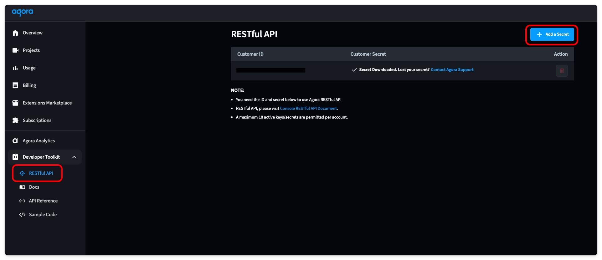

50% of Americans watch content with subtitles. Why can't we have this with video calls? Actually, we can do this by using Real-Time Transcription with Agora.

This guide is the third part in a series about building backends with Astro. The first guide covered Token Generation with Astro so we can secure our video calls. We will use the token generation logic in this guide. The second guide was about recording your video to a storage provider of your choice. Real-Time Transcription is a separate feature, so it does not rely on the cloud recording guide, but we will need to generate tokens. Let's get started.

## Prerequisites
1. NodeJS and Astro installed.
2. A developer account with [Agora](https://console.agora.io/).
3. A token generator built with Astro. Find the [guide here](https://github.com/AgoraIO-Community/astro-backend/blob/main/docs/TOKENS.md).

## Project Setup
This guide will build upon the [token generator guide](https://github.com/AgoraIO-Community/astro-backend/blob/main/docs/TOKENS.md). The token generator guide walks through building the `api/tokens.json` endpoint, which returns a token used to secure your video calls. This endpoint uses a `handleGenerateToken` function that handles token generation logic. Since it is on the same backend server, we will use this function directly within the real-time transcription endpoint.

From the previous guide, you should have `APP_ID` and the `APP_CERTIFICATE` in your environment variables. We will use the `APP_ID` to start and stop the transcription.

## Real Time Transcription Overview
Real-Time Transcription is a RESTful API provided by Agora that allows you to transcribe your video calls in real time and/or store them within a storage provider of your choice. Your business backend should trigger this transcription service so that sensitive data isn't being passed directly to and from the application.

The flow for a successful Real Time Transcription session is as follows.
1. Acquire the Agora Real-Time Transcription resource.
2. Start the Real Time Transcription service.
3. Stop the Real Time Transcription service.

## Enable Agora RESTful API
This whole guide relies on a connection to the Agora RESTful API. To connect to it, you will need a Customer ID and Customer Secret. You can find these by going into the Agora Console, selecting the RESTful API tab under Developer Toolkit, and clicking the "Add a Secret" button. Then, copy these values and store them in a `CUSTOMER_ID` and a `CUSTOMER_SECRET` environment variable.



## Define an Endpoint
We will have two endpoints: `api/transcription/start.json` and `api/transcription/stop.json`. Because our endpoints need input information, we will use a `POST` request to pass the input as the request body.

We will check that these inputs are not empty. If they are, we will return a Bad Request response using our helper function from `utils/sendResponse.ts`. 

Our endpoints will need the following information in the body:
- `api/transcription/start.json` will need `channel`
- `api/transcription/stop.json` will need `taskId` and `builderToken`

If everything is executed properly, we send a successful response using our helper function with data we will fill in later.

```ts
import type { APIContext } from "astro";

export async function POST({ request }: APIContext) {
    const { channel } = await request.json()

    if (!channel) {
        return sendBadRequest("channel is required")
    }

    return sendSuccessfulResponse("<return data>")
}
```

## Make Request Helper Functions
The rest of this guide will focus on the implementation of Cloud Recording, which includes calling the Agora API. To simplify the code and have a uniform request structure, we will set up a helper function in `utils/makeRequest.ts`. 

The `makeRequest` function defines all the headers, executes the request, and returns the response. 

The inputs will need the `method` (we will use GET and POST), `url`, `body`, and the `credential`. 

```ts
export const makeRequest = async (method: string, url: string, credential: string, body?: string) => {
    const headers = new Headers({
        "Authorization": "basic " + credential,
        "Content-Type": "application/json",
        "Access-Control-Allow-Origin": "*",
        "Access-Control-Allow-Methods": `${method}, OPTIONS`,
    });

    const res = await fetch(url, {
        method: method,
        headers: headers,
        body: body
    })
    if (!res.ok) {
        console.log(await res.text())
        throw new Error("Failed to make request")
    }
    return res
}
```

Another helper function in `utils/generateCredential.ts` will generate this credential. It is a base-64 encoded credential using the Customer ID and Customer Secret.

```ts
export const generateCredential = () => {
const credential = import.meta.env.CUSTOMER_ID + ":" + import.meta.env.CUSTOMER_SECRET

const base64_credential = btoa(credential)
return base64_credential
}
```

## Generate Transcription Resource
The first step in transcribing your video calls is generating a real-time transcription resource. Behind the scenes, this spins up a backend Agora service that can transcribe video calls. 

To generate this resource, we make our first request to the Agora service. This will use the endpoint `https://api.agora.io/v1/projects/${appId}/rtsc/speech-to-text/builderTokens` to create the resource and return a builderToken for that resource. We will use the channel name as an `instanceId` for this resource. 

We don't need to create an endpoint for this function since it will only be used when starting a transcribing session on this same backend server. Because of this, we define this function in the `utils/generateResource.ts` file to keep the code organized. 

```ts
import { makeRequest } from "./makeRequest"

export const generateRealTimeTranscriptionResource = async (channel: string, credential: string, appId: string) => {
    const body = {
        "instanceId": channel
    }
    const url = `https://api.agora.io/v1/projects/${appId}/rtsc/speech-to-text/builderTokens`
    const res = await makeRequest("POST", url, credential, JSON.stringify(body))
    const data = await res.json()
    const builderToken = data["tokenName"]

    return builderToken
}
```

## Start Transcribing
We can combine all the above sections and start the transcribing within the POST request in the `api/transcription/start.json.ts` file. First, we generate the credential, then use that credential to generate a resource, and create two tokens for the two UIDs. Real-Time Transcription requires one UID to join the channel and transcribe the text and another UID to stream the transcribed text back to the call.

Then, we make a request with the Agora endpoint `https://api.agora.io/v1/projects/${APP_ID}/rtsc/speech-to-text/tasks?builderToken=${builderToken}` and pass in the transcription configuration into the request body. 

You can find a complete list of request body properties within the [Agora Postman collection](https://documenter.getpostman.com/view/6319646/SVSLr9AM#69bd200a-7543-4104-8ccc-415741abbeb7). 

```ts
const botUid = "2"
const outputUid = "3"
const credential = generateCredential()
const builderToken = await generateRealTimeTranscriptionResource(channel, credential, APP_ID)
const botToken = await handleGenerateToken({ channel: channel, role: 1, uid: botUid, expireTime: 3600 })
const outputToken = await handleGenerateToken({ channel: channel, role: 2, uid: outputUid, expireTime: 3600 })
const url = `https://api.agora.io/v1/projects/${APP_ID}/rtsc/speech-to-text/tasks?builderToken=${builderToken}`
const body = {
    "audio": {
        "subscribeSource": "AGORARTC",
        "agoraRtcConfig": {
            "channelName": channel,
            "uid": botUid,
            "token": botToken,
            "channelType": "LIVE_TYPE",
            "subscribeConfig": {
                "subscribeMode": "CHANNEL_MODE"
            }
        }
    },
    "config": {
        "features": [
            "RECOGNIZE"
        ],
        "recognizeConfig": {
            "language": "en-US,es-ES",
            "model": "Model",
            "output": {
                "destinations": [
                    "AgoraRTCDataStream",
                ],
                "agoraRTCDataStream": {
                    "channelName": channel,
                    "uid": outputUid,
                    "token": outputToken
                }
            }
        }
    }
}
const res = await makeRequest("POST", url, credential, JSON.stringify(body))
const data = await res.json()
const taskId = data.taskId

return sendSuccessfulResponse({
    taskId: taskId,
    builderToken: builderToken,
})
```

Upon a successful response, you will receive a `taskId`. Both the `taskId` and the `builderToken` will need to be used to stop the transcription, so they must be returned to the caller.

To test this, run your backend using `npm run dev`. You can use cURL to send a `POST` request in your terminal with a body containing `channel`.

```
curl -X POST http://localhost:4321/api/transcription/start.json \
  -H "Content-Type: application/json" \
  -d '{
    "channel": "test"
  }'
```

If your `POST` request is missing information, you will receive a Bad Request response telling you what you missed. If you have a proper request, you will receive a successful response that looks like this:

```
{"taskId":"<long string>","builderToken":"<another long string>"}
```

## Stop Transcribing
To stop the transcription, you must send a `DELETE` command to a URL containing the App ID, Task ID, and the Builder Token.

```ts
const credential = generateCredential()
const url = `https://api.agora.io/v1/projects/${APP_ID}/rtsc/speech-to-text/tasks/${taskId}?builderToken=${builderToken}`
const res = await makeRequest("DELETE", url, credential)
const data = await res.json()

return sendSuccessfulResponse(data)
```

To test that it is working, run this cURL command.

```
curl -X DELETE "http://localhost:4321/api/transcription/stop.json" \
  -H "Content-Type: application/json" \
  -d '{
    "taskId": "<from start command return>",
    "builderToken": "<from start command return>"
  }'
```

You now have a fully working Real Time Transcription backend with Astro.

With this guide, you have a backend that can generate a token, record your video calls, and transcribe them. Now, all that is needed is a front end to utilize these features. Here is a [guide on how to build a Video Call front end with Astro](https://www.agora.io/en/blog/build-a-video-call-app-with-astro-and-reactjs/).